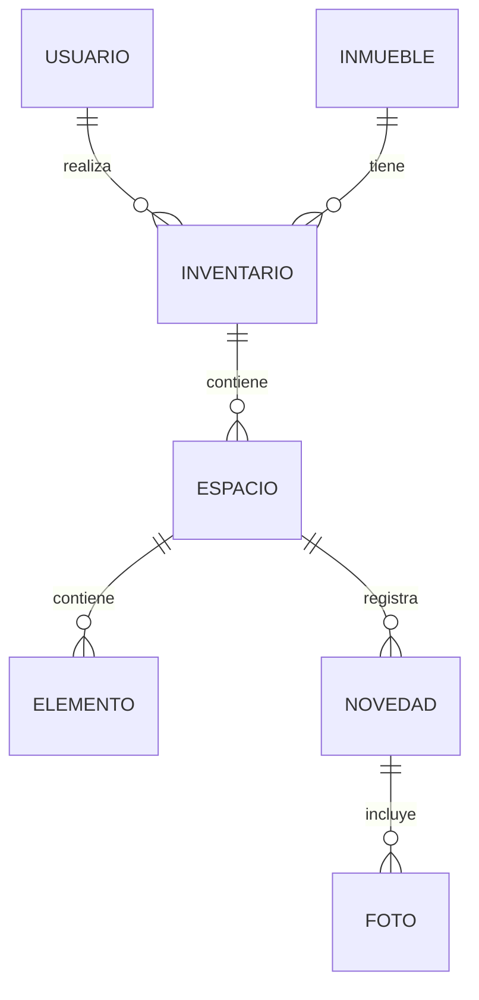
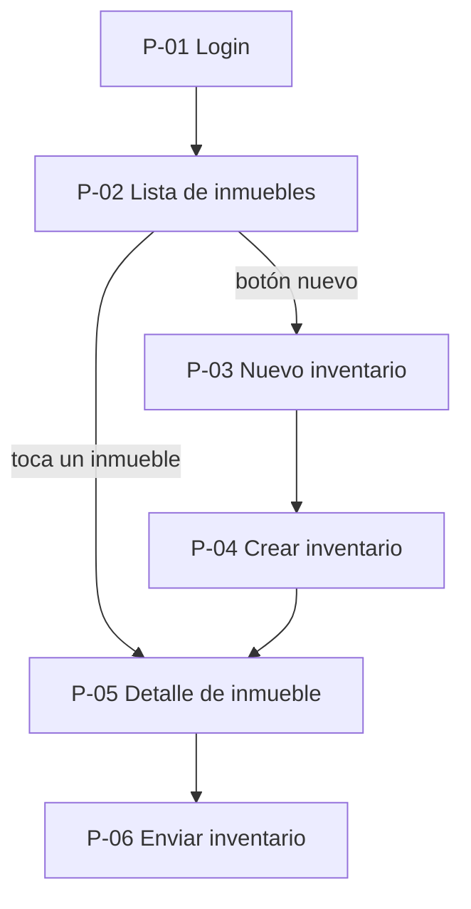

# Arrendamientos Butaquito – Inventario Digital

| | |
|---|---|
| Integrantes | Integrante 1, Integrante 2, Integrante 3 |
| Curso y grupo | Programación Móvil (IF2004), grupo 601 |
| Fecha | Por definir |
| Versión | 1.0 |

## Tabla de contenido

- [Arrendamientos Butaquito – Inventario Digital](#arrendamientos-butaquito--inventario-digital)
  - [Tabla de contenido](#tabla-de-contenido)
  - [1. Descripción general](#1-descripción-general)
  - [2. Problema](#2-problema)
  - [3. Objetivos](#3-objetivos)
    - [3.1 Objetivo general](#31-objetivo-general)
    - [3.2 Objetivos específicos](#32-objetivos-específicos)
  - [4. Stakeholders, actores y roles](#4-stakeholders-actores-y-roles)
  - [5. Alcance](#5-alcance)
    - [5.1 Incluye](#51-incluye)
    - [5.2 No incluye](#52-no-incluye)
  - [6. Funcionalidades](#6-funcionalidades)
  - [7. Requerimientos funcionales](#7-requerimientos-funcionales)
  - [8. Requerimientos no funcionales](#8-requerimientos-no-funcionales)
  - [9. Reglas de negocio](#9-reglas-de-negocio)
  - [10. Modelo de datos](#10-modelo-de-datos)
  - [11. Pantallas y mapa de navegación](#11-pantallas-y-mapa-de-navegación)
  - [12. Mockup](#12-mockup)
    - [P-01 Login](#p-01-login)
    - [P-02 Lista de inmuebles](#p-02-lista-de-inmuebles)
    - [P-04 Crear inventario](#p-04-crear-inventario)
    - [Detalle de espacio (parte de P-04)](#detalle-de-espacio-parte-de-p-04)
    - [Resumen antes de finalizar (parte de P-05)](#resumen-antes-de-finalizar-parte-de-p-05)
    - [P-06 Enviar inventario](#p-06-enviar-inventario)
  - [13. Historias de usuario, casos de uso, restricciones y supuestos](#13-historias-de-usuario-casos-de-uso-restricciones-y-supuestos)
    - [Historias de usuario](#historias-de-usuario)
    - [Casos de uso](#casos-de-uso)
    - [Restricciones](#restricciones)
    - [Supuestos](#supuestos)
  - [14. Arquitectura técnica y navegación implementada](#14-arquitectura-técnica-y-navegación-implementada)
  - [Historial de cambios](#historial-de-cambios)
  - [Referencias](#referencias)
  - [Declaración de uso de inteligencia artificial](#declaración-de-uso-de-inteligencia-artificial)

## 1. Descripción general

Arrendamientos Butaquito es una aplicación móvil construida en Flutter que digitaliza el proceso de inventario de inmuebles. Permite que un inventarista registre, por espacio y elemento, el estado físico de un inmueble con fotografías y novedades, y que ese inventario se envíe por correo a la persona interesada (propietario, inquilino o asesor) sin depender de papel.

## 2. Problema

Arrendamientos Butaquito lleva el registro de sus inventarios de inmuebles de forma manual, lo que genera demoras en la entrega y recepción de inmuebles. Se han perdido inventarios completos que han tenido que repetirse, lo que afecta la reputación de la empresa. Se requiere una solución que agilice el registro y modernice la forma de compartir el inventario con arrendatarios, propietarios y asesores.

## 3. Objetivos

### 3.1 Objetivo general

Digitalizar el proceso de elaboración, almacenamiento y distribución de inventarios de inmuebles de Arrendamientos Butaquito, reduciendo tiempos y evitando la pérdida de información.

### 3.2 Objetivos específicos

| ID | Objetivo específico | Situación actual | Meta |
|---|---|---|---|
| OBJ-01 | Reducir el tiempo de elaboración del inventario | 4 horas por inventario | 2 horas o menos por inventario |
| OBJ-02 | Eliminar la pérdida de inventarios | Se han perdido inventarios completos | 0 inventarios perdidos |
| OBJ-03 | Disminuir el tiempo de entrega del inventario | Se espera a que el inventario llegue físicamente a la sede | Envío inmediato por correo al finalizar |
| OBJ-04 | Garantizar la trazabilidad del inmueble | No hay registro consistente | 100 % de trazabilidad del inmueble arrendado |
| OBJ-05 | Mejorar la calidad del respaldo del inventario | Quejas de propietarios sin evidencia que las respalde o desmienta | Respaldo fotográfico de cada espacio y novedad |

## 4. Stakeholders, actores y roles

**Stakeholders** (interesados que no necesariamente usan la app): Propietario, Inquilino, Asesor.

**Actores del sistema:** Inventarista, Administrador, API de Gmail (actor externo que envía los correos).

La app tiene inicio de sesión con dos roles:

| Rol | Puede hacer | No puede hacer |
|---|---|---|
| Inventarista | Iniciar sesión, crear inventarios, registrar espacios/elementos/novedades, adjuntar fotos, guardar borradores, finalizar inventarios propios | Enviar inventarios de otros inventaristas, gestionar usuarios |
| Administrador | Iniciar sesión, consultar todos los inventarios, ver su estado y responsable, enviar inventarios finalizados por correo a propietario/inquilino/asesor | Editar el contenido de un inventario ya finalizado |

## 5. Alcance

### 5.1 Incluye

- Inicio de sesión con roles de inventarista y administrador.
- Registro de inventarios por inmueble, espacio, elemento y novedad.
- Adjuntar fotografías de evidencia.
- Guardado local del progreso y sincronización en la nube.
- Envío del inventario finalizado por correo electrónico (API de Gmail).

### 5.2 No incluye

- Aplicación web o de escritorio.
- Geolocalización del inmueble.
- Funcionamiento sin conexión a internet (offline).

## 6. Funcionalidades

- Registrar inventarios (RF-02 a RF-06).
- Consultar y finalizar inventarios (RF-07, RF-08).
- Enviar inventarios por correo (RF-09).
- Registro e inicio de sesión de usuarios (RF-01).

## 7. Requerimientos funcionales

| ID | Descripción | Rol responsable | Relacionado con |
|---|---|---|---|
| RF-01 | El sistema debe permitir iniciar sesión con correo y contraseña | Inventarista, Administrador | HU-01, CU-01 |
| RF-02 | El sistema debe permitir crear un inventario para un inmueble | Inventarista | HU-01, CU-01 |
| RF-03 | El sistema debe permitir registrar los espacios del inmueble | Inventarista | HU-02, CU-02 |
| RF-04 | El sistema debe permitir registrar novedades por espacio o elemento | Inventarista | HU-03, CU-03 |
| RF-05 | El sistema debe permitir adjuntar fotografías a un espacio o novedad | Inventarista | HU-04, CU-04 |
| RF-06 | El sistema debe permitir guardar un inventario incompleto como borrador | Inventarista | HU-05, CU-05 |
| RF-07 | El sistema debe mostrar la información pendiente de un inventario | Inventarista | HU-06, CU-06 |
| RF-08 | El sistema debe permitir finalizar un inventario solo si está completo | Inventarista | HU-07, CU-07 |
| RF-09 | El sistema debe permitir enviar un inventario finalizado por correo | Administrador | HU-11, CU-08 |
| RF-10 | El sistema debe permitir consultar el historial de inventarios y su estado | Administrador | HU-09, HU-10 |

## 8. Requerimientos no funcionales

| ID | Categoría | Descripción |
|---|---|---|
| RNF-01 | Rendimiento | Un inventario debe poder completarse en 2 horas o menos |
| RNF-02 | Disponibilidad de datos | La información registrada no debe perderse ante cierres o fallos de la app |
| RNF-03 | Seguridad | El acceso a la app requiere autenticación (Firebase Authentication) |
| RNF-04 | Compatibilidad | La app se ejecuta solo en dispositivos móviles (Android/iOS) |
| RNF-05 | Usabilidad | La interfaz debe ser simple de operar en campo, con pocos pasos por pantalla |

## 9. Reglas de negocio

| ID | Regla |
|---|---|
| RN-01 | Un inventario no se puede enviar si está incompleto |
| RN-02 | Un inventario debe corresponder a un inmueble |
| RN-03 | Un inventario debe ser realizado por un inventarista |
| RN-04 | Un inventario debe registrar el estado de los espacios que hacen parte del inmueble |
| RN-05 | Una novedad debe estar asociada al espacio o elemento donde fue encontrada |
| RN-06 | Un inventario solo se puede entregar al propietario, inquilino o asesor relacionado con el inmueble |
| RN-07 | Un inventario realizado debe conservarse como registro del estado del inmueble en el momento en que fue hecho |
| RN-08 | Un inventario no se puede considerar terminado mientras tenga información pendiente de registrar |

## 10. Modelo de datos

| Entidad | Atributo | Tipo | Descripción |
|---|---|---|---|
| Usuario | id, correo, contraseña, rol | String, String, String, Enum | Inventarista o administrador que inicia sesión |
| Inmueble | codigo, direccion | String, String | Propiedad sobre la que se hace el inventario |
| Inventario | id, codigoInmueble, idInventarista, fecha, estado | String, String, String, Date, Enum | Registro del estado del inmueble en un momento dado (RN-02, RN-03) |
| Espacio | id, idInventario, nombre | String, String, String | Habitación o zona del inmueble (RN-04) |
| Elemento | id, idEspacio, nombre, estado | String, String, String, Enum | Objeto revisado dentro de un espacio (bueno/regular/malo) |
| Novedad | id, idEspacio, descripcion | String, String, String | Daño o condición particular encontrada (RN-05) |
| Foto | id, idNovedad o idEspacio, ruta | String, String, String | Evidencia fotográfica adjunta |



## 11. Pantallas y mapa de navegación

| ID | Pantalla | Propósito | Requerimiento relacionado |
|---|---|---|---|
| P-01 | Login | Autenticar al usuario (inventarista o administrador) | RF-01 |
| P-02 | Lista de inmuebles | Mostrar los inmuebles asignados y dar acceso a su detalle | RF-02, RF-10 |
| P-03 | Nuevo inventario | Formulario para capturar código de inmueble, fecha y tipo de inventario | RF-02 |
| P-04 | Crear inventario | Registrar espacios, estado, novedades y fotos | RF-03, RF-04, RF-05, RF-06 |
| P-05 | Detalle de inmueble | Confirmar el código de inmueble seleccionado y continuar el flujo | RF-07 |
| P-06 | Enviar inventario | Seleccionar destinatario y enviar el inventario por correo | RF-08, RF-09 |



El flujo de lista a detalle está en P-02 → P-05: al tocar un inmueble de la lista, su código (`codigo`) se pasa como dato a la pantalla de detalle.

## 12. Mockup

### P-01 Login


### P-02 Lista de inmuebles


### P-04 Crear inventario


### Detalle de espacio (parte de P-04)


### Resumen antes de finalizar (parte de P-05)


### P-06 Enviar inventario


## 13. Historias de usuario, casos de uso, restricciones y supuestos

### Historias de usuario

| ID | Rol | Historia | Requerimiento |
|---|---|---|---|
| HU-01 | Inventarista | Como inventarista quiero crear un inventario para un inmueble | RF-02 |
| HU-02 | Inventarista | Como inventarista quiero registrar los espacios del inmueble | RF-03 |
| HU-03 | Inventarista | Como inventarista quiero registrar las novedades encontradas en cada espacio | RF-04 |
| HU-04 | Inventarista | Como inventarista quiero adjuntar fotos de los espacios y novedades | RF-05 |
| HU-05 | Inventarista | Como inventarista quiero guardar un inventario aunque no esté terminado | RF-06 |
| HU-06 | Inventarista | Como inventarista quiero consultar qué información falta por registrar | RF-07 |
| HU-07 | Inventarista | Como inventarista quiero finalizar un inventario cuando esté completo | RF-08 |
| HU-08 | Administrador | Como administrador quiero evitar que se envíen inventarios incompletos | RF-08, RN-01 |
| HU-09 | Administrador | Como administrador quiero consultar los inventarios realizados | RF-10 |
| HU-10 | Administrador | Como administrador quiero identificar qué inventarista realizó cada inventario | RF-10 |
| HU-11 | Administrador | Como administrador quiero enviar un inventario terminado por correo | RF-09 |
| HU-12 | Propietario | Como propietario quiero recibir el inventario de mi inmueble | RF-09 |

### Casos de uso

**CU-01. Crear inventario** (HU-01)
- Actor: Inventarista.
- Precondición: el inmueble ya está registrado.
- Flujo: selecciona crear inventario → selecciona el inmueble → la app crea el inventario asociado → la app lo muestra para empezar a registrarlo.
- Excepción: si el inmueble ya tiene un inventario activo, la app lo informa y no permite crear otro.

**CU-02. Registrar espacios del inmueble** (HU-02)
- Actor: Inventarista.
- Precondición: ya existe un inventario creado.
- Flujo: agrega un espacio → registra su nombre → la app lo guarda asociado al inventario y permite seguir agregando espacios.
- Excepción: si falta información requerida del espacio, la app la solicita antes de guardar.

**CU-03. Registrar novedades** (HU-03)
- Actor: Inventarista.
- Precondición: existe al menos un espacio registrado.
- Flujo: selecciona un espacio → registra la novedad → la app la guarda asociada al espacio.
- Excepción: si falta la descripción, la app la solicita antes de guardar.

**CU-04. Adjuntar fotografías** (HU-04)
- Actor: Inventarista.
- Precondición: existe un espacio o novedad registrada.
- Flujo: selecciona el espacio o novedad → toma o elige una foto → la app la asocia y la guarda.
- Excepción: si la foto no carga, la app informa y permite reintentar.

**CU-05. Guardar inventario** (HU-05)
- Actor: Inventarista.
- Flujo: registra la información disponible → guarda → la app la almacena y deja el inventario disponible para continuar después.
- Excepción: si falla el guardado, la app informa al inventarista.

**CU-06. Consultar información pendiente** (HU-06)
- Actor: Inventarista.
- Precondición: el inventario está guardado pero no finalizado.
- Flujo: abre el inventario → la app revisa lo registrado → muestra lo que falta.
- Excepción: si no falta nada, la app informa que el inventario está completo.

**CU-07. Finalizar inventario** (HU-07, RN-08)
- Actor: Inventarista.
- Flujo: selecciona finalizar → la app verifica que la información esté completa → marca el inventario como finalizado.
- Excepción: si falta información, la app no permite finalizar y muestra qué falta.

**CU-08. Enviar inventario** (HU-11, RN-01, RN-06)
- Actor: Administrador.
- Precondición: el inventario ya está finalizado.
- Flujo: selecciona el inventario → selecciona el destinatario → la app verifica que esté completo → lo envía por la API de Gmail → informa el envío.
- Excepción: si está incompleto, la app no permite enviarlo.

### Restricciones

- Tecnología: Flutter y Dart, sin otro stack.
- Tiempo: las 14 semanas del curso.
- Equipo: grupos de trabajo de 3 personas.
- Plataforma: solo aplicación móvil.

### Supuestos

- El inventarista cuenta con un dispositivo móvil con cámara y conexión a internet la mayor parte del tiempo.
- El correo del destinatario (propietario, inquilino o asesor) es correcto y está activo.
- El inmueble ya existe en el sistema antes de crear un inventario sobre él.

## 14. Arquitectura técnica y navegación implementada

**Stack:** Flutter y Dart. SQLite para el progreso local. Firebase Authentication para el inicio de sesión y Firestore para la sincronización en la nube. Arquitectura por capas (interfaz, lógica, datos).

La navegación implementada usa `Navigator.push` con `MaterialPageRoute`, pasando datos por el constructor del widget destino:

```dart
Navigator.push(
  context,
  MaterialPageRoute(
    builder: (context) => DetalleInmueble(codigo: codigo),
  ),
);
```

| Ruta (pantalla origen → destino) | Pantalla | Dato que recibe | Pantalla siguiente |
|---|---|---|---|
| Login → Lista | P-01 → P-02 | — | P-02 |
| Lista → Detalle | P-02 → P-05 | `codigo` del inmueble tocado | P-06 |
| Lista → Nuevo inventario | P-02 → P-03 | — | P-04 |
| Nuevo inventario → Crear inventario | P-03 → P-04 | `codigoInmueble` capturado en el formulario | P-05 |
| Crear inventario → Detalle | P-04 → P-05 | `codigoInmueble` | P-06 |
| Detalle → Enviar inventario | P-05 → P-06 | `codigoInmueble` | — |

## Historial de cambios

| Versión | Fecha | Descripción |
|---|---|---|
| 1.0 | Por definir | Primera versión del documento de definición del proyecto |

## Referencias

- Documentación oficial de Flutter: https://docs.flutter.dev
- Documentación oficial de Firebase Authentication: https://firebase.google.com/docs/auth
- Documentación de la API de Gmail: https://developers.google.com/gmail/api

## Declaración de uso de inteligencia artificial

Se utilizó Google Stitch para el desarrollo visual de las pantallas (mockups) y su navegación.
El contenido sustantivo (problema, objetivos, reglas de negocio, historias y casos de uso) fue definido por el equipo.
